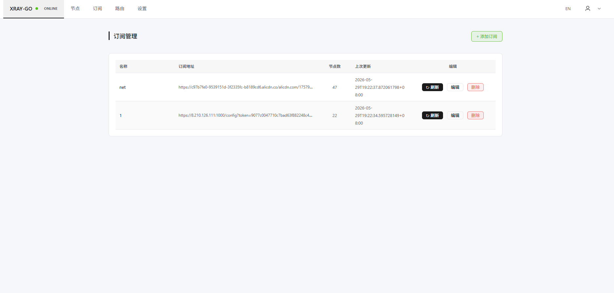

# xray-go

单一二进制代理工具，内嵌 xray-core 和 sing-box 双核心，支持自动测速选节点、地区筛选、Web 管理界面。

## 快速开始

```bash
./xray-go
```

首次运行输入订阅地址，程序自动解析节点、测速、连接最优节点并启动代理。

## Web 管理界面

运行 `./xray-go web` 后访问 `http://localhost:18700`：



### 功能
- **节点管理** — 浏览所有节点，按地区筛选，单节点/批量测速，热切换
- **订阅管理** — 添加多个订阅源，一键刷新，自动解析
- **手动节点** — 通过 `vmess://` / `vless://` / `trojan://` / `ss://` / `anytls://` 链接单独添加
- **路由设置** — 全局代理 / 白名单 / 黑名单，支持 geosite/geoip
- **设置** — 代理端口、中英文切换
- **实时推送** — WebSocket 推送代理状态和测速进度

### 认证
首次访问需创建管理员账户，之后使用 JWT 登录认证。

## 命令行模式

```bash
./xray-go                     # 交互模式：选择地区 → 测速 → 启动
./xray-go start               # 无交互启动（使用上次配置）
./xray-go start --update      # 强制更新订阅后启动
./xray-go --url "https://example.com/sub" --port 1080
```

### 参数

| 参数 | 默认值 | 说明 |
|------|--------|------|
| `web` | — | 启动 Web 管理服务（端口 18700） |
| `start` | — | 无交互启动（使用已保存配置） |
| `--url` | — | 指定订阅地址 |
| `--port` | 16708 | HTTP 代理端口（SOCKS5 +1） |
| `--update` | false | 强制重新获取订阅并测速 |

### 代理地址

| 类型 | 地址 |
|------|------|
| HTTP | `127.0.0.1:16708` |
| SOCKS5 | `127.0.0.1:16709` |

```bash
curl -x http://127.0.0.1:16708 https://api.ipify.org
curl -x socks5h://127.0.0.1:16709 https://api.ipify.org
```

## 支持协议

| 协议 | 核心 | 传输方式 |
|------|------|---------|
| VMess | xray-core | tcp / ws / grpc |
| VLESS + Reality | xray-core | tcp / ws / grpc |
| Trojan | xray-core | tcp / ws / grpc |
| Shadowsocks | xray-core | tcp |
| AnyTLS | sing-box | tcp |

## 可识别地区

通过节点名称自动识别。

## 测速机制

- 并发 5 节点同时测试
- 为每个节点启动临时代理 → 等待 200ms 启动 → 通过 SOCKS5 请求 `gstatic.com/generate_204` → 记录延迟
- 自动选择延迟最低的节点

## 配置文件

**路径：** `~/.xray-go/config.json`

存储订阅地址及缓存节点、手动节点、路由模式、端口、数据来源地区等信息。

其他文件：
- `~/.xray-go/geoip.dat` / `geosite.dat` — 路由规则数据（自动下载，7 天更新）
- `~/.xray-go/web-users.json` / `jwt-secret` — Web 认证

## 编译

```bash
# Go 1.24+
go build -o xray-go .

# 单独构建前端
cd web/frontend && npm i && npm run build
```

前端源码在 `web/frontend/`，构建产物嵌入 `web/static/` 通过 `go:embed` 打包进二进制。

## 核心版本

- xray-core v26.3.27
- sing-box v1.13.12
